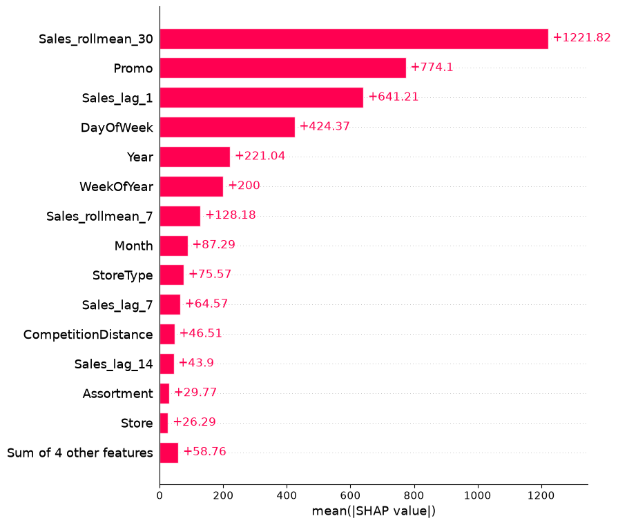
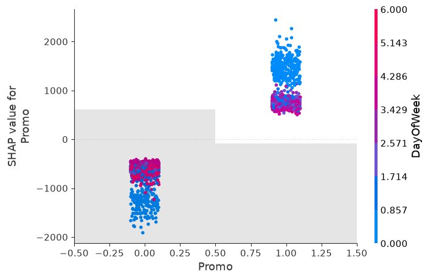

# Rossmann Store Sales Forecasting


Forecasting daily sales across 1,115 Rossmann drug stores using historical panel data, and
quantifying the impact of promotions and holidays on sales.

**Author:** [Bhargavi Anupati](https://github.com/BhargaviAnupati) · [LinkedIn](https://www.linkedin.com/in/bhargavi-r-9667b4231/)

## Results at a Glance

**XGBoost cut forecast error roughly in half versus the strongest naive baseline**, and running
a promotion is associated with an estimated **20.8% sales lift**, controlling for store,
season, and recent sales history.

| Top drivers of predicted sales (SHAP) | Promotion effect on predictions (SHAP) |
|---|---|
|  |  |


## Table of Contents
- [Results at a Glance](#results-at-a-glance)
- [Project Overview](#project-overview)
- [Dataset](#dataset)
- [Methods](#methods)
- [Tech Stack](#tech-stack)
- [Project Structure](#project-structure)
- [How to Run](#how-to-run)
- [Key Takeaways](#key-takeaways)
- [Model Performance](#model-performance)
- [Limitations](#limitations)
- [Next Steps](#next-steps)
- [Author](#author)

## Project Overview

**Business question:** Can we forecast daily sales for each Rossmann store up to six weeks in
advance, and how much do promotions and holidays actually lift sales? Accurate forecasts help
with inventory planning, staffing, and promotional strategy at the store level.

This is a **panel data** problem: 1,115 stores, each observed repeatedly over ~2.5 years — as
opposed to a single time series or a one-row-per-entity tabular dataset. That structure opens up
techniques not used in a purely cross-sectional project: time-based validation, lag/rolling
features, and seasonality analysis.

## Dataset

- **Source:** [Rossmann Store Sales — Kaggle](https://www.kaggle.com/c/rossmann-store-sales)
- **Files:** `train.csv` (daily sales history), `store.csv` (store metadata), `test.csv` (holdout for Kaggle submission, optional to use)
- **Size:** ~1,017,209 daily observations across 1,115 stores, January 2013 – July 2015
- **Key fields:**
  - `Sales`, `Customers` — daily targets
  - `Open`, `Promo`, `StateHoliday`, `SchoolHoliday` — day-level flags
  - `StoreType`, `Assortment`, `CompetitionDistance`, `Promo2` — store-level metadata
- **Known data quality notes:**
  - Sales = 0 on days a store is closed (`Open = 0`) — must be handled separately from a
    genuinely low-sales open day
  - Some missing `CompetitionDistance` and `Promo2`-related values in `store.csv`

## Methods

1. **Data Loading & Cleaning** ✅
   - Merge `train.csv` with `store.csv`
   - Handle closed-store days and missing store metadata
   - Verify date continuity per store

2. **Exploratory Data Analysis (EDA)** ✅
   - Aggregate and per-store sales trends over time
   - Day-of-week and monthly seasonality
   - Promotion and holiday effects on sales
   - Differences across store types and assortment levels

3. **Feature Engineering** ✅
   - Lag features (sales 1, 7, 14 days ago), computed per store
   - Rolling averages (7-day, 30-day), shifted to avoid leakage
   - Calendar features (day of week, month, year, week of year, weekend flag)

4. **Time-Based Train/Validation/Test Split** ✅
   - Chronological split (no random shuffling) to simulate real forecasting conditions

5. **Modeling** ✅
   - **Baseline:** naive "same day last week" / moving average
   - **Comparison model:** XGBoost with engineered time features

6. **Evaluation** ✅
   - RMSE, MAE, and RMSPE (root mean square percentage error — the original competition metric)

7. **Interpretation** ✅
   - SHAP global importance, dependence plots (Promo, StateHoliday), and individual forecast
     explanation
   - Model-based counterfactual analysis to isolate the promotion lift from other factors

8. **Deployment** — planned
   - Optional Streamlit dashboard: pick a store, see its forecast

## Tech Stack

| Category | Tools |
|---|---|
| Language | Python |
| Data handling | pandas, numpy (`<2`) |
| Visualization | matplotlib, seaborn |
| Forecasting/Modeling | scikit-learn, XGBoost, Prophet |
| Interpretation | SHAP |
| Deployment | Streamlit |
| Environment | Jupyter Lab |

## Project Structure

```
rossmann-sales-forecasting/
├── README.md
├── requirements.txt
├── data/                                          # raw data (train.csv, store.csv — not tracked, see below)
├── notebooks/
│   ├── 01_data_loading_and_eda.ipynb                     ✅ complete
│   ├── 02_feature_engineering_and_baseline.ipynb         ✅ complete
│   ├── 03_forecasting_models_and_evaluation.ipynb        ✅ complete
│   └── 04_interpretation_and_promo_impact.ipynb          ✅ complete
├── src/                                           # reusable functions
├── app/                                           # Streamlit dashboard
└── reports/                                       # exported figures
```

> **Note on data:** This dataset comes from a Kaggle competition and requires a Kaggle account
> to download. It is not redistributed in this repo — download `train.csv` and `store.csv` from
> the [competition page](https://www.kaggle.com/c/rossmann-store-sales/data) and place them in `data/`.

## How to Run

```bash
# Clone the repo
git clone https://github.com/BhargaviAnupati/rossmann-sales-forecasting.git
cd rossmann-sales-forecasting

# Install dependencies
pip install -r requirements.txt

# Download train.csv and store.csv from Kaggle into data/, then:
jupyter lab notebooks/01_data_loading_and_eda.ipynb
```

## Key Takeaways

- **Model performance:** XGBoost achieved an RMSPE of 0.2 on the validation set, cutting error
  by roughly a third compared to the strongest naive baseline (7-day rolling average, RMSPE 0.3)
  and by more than half compared to the simpler same-day-last-week baseline (RMSPE 0.5).
- **Top predictive features (from SHAP):** the 30-day rolling average of sales was the single
  strongest driver of predictions, followed closely by **Promo** — notably ahead of the
  individual lag features (yesterday's and last week's sales). This indicates the model isn't
  simply repeating recent history; it's picking up a genuine, independent promotional effect.
- **Promotion impact:** running a promotion is associated with an estimated **20.8% lift in
  sales** (about 1,466 additional units/currency per store-day on average), holding store,
  season, and recent sales history constant — estimated via a model-based counterfactual
  (predicting the same store-days with `Promo` forced to 0 vs. 1) rather than a simple
  before/after average. The SHAP dependence plot suggests this lift is somewhat larger earlier
  in the week than later, an angle worth exploring further.
- **Holiday impact:** no clear, consistent holiday effect was detected. The few open-on-holiday
  store-days in the data showed inconsistent effects (some strongly positive, some strongly
  negative), most likely because state holidays are rare in this dataset and most stores are
  closed on them entirely (already excluded via the `Open=1` filter). This is reported as a
  genuine null finding rather than a limitation of the model.
- **Practical implication:** these forecasts could support inventory and staffing decisions up
  to six weeks out, and the ~21% promo lift estimate could inform whether running additional
  promotions is cost-effective — pending validation against actual promotion costs, which
  weren't available in this dataset.

## Model Performance

| Model | RMSE | MAE | RMSPE |
|---|---|---|---|
| Naive: same day last week | 2758.8 | 2155.1 | 0.5 |
| Naive: 7-day rolling avg | 2003.9 | 1482.8 | 0.3 |
| XGBoost | 1153.8 | 886.0 | 0.2 |

**Selected model: XGBoost.** It roughly halves both RMSE and RMSPE compared to the strongest
naive baseline (7-day rolling average), and cuts error by more than half versus the simpler
same-day-last-week baseline — a clear, easily communicated improvement.

## Limitations

- Data covers 2013–2015 German drug stores; patterns may not generalize to other retail
  categories, countries, or time periods (e.g. post-pandemic shopping behavior).
- `CompetitionDistance` and `Promo2` fields have missing values that require an explicit
  imputation decision — document the choice made and why.

## Next Steps

- [x] Complete data loading, cleaning, and EDA
- [x] Engineer time-aware features and set up chronological split
- [x] Build baseline and forecasting models
- [x] Evaluate and compare models
- [x] Interpret results and quantify promotion/holiday lift
- [ ] Optional: build Streamlit dashboard
- [ ] Write up plain-English summary for a non-technical audience (blog post / one-pager)

## Author

**Bhargavi Anupati**
[LinkedIn](https://www.linkedin.com/in/bhargavi-r-9667b4231/) · [GitHub](https://github.com/BhargaviAnupati)

## License

This project is licensed under the [MIT License](LICENSE).
