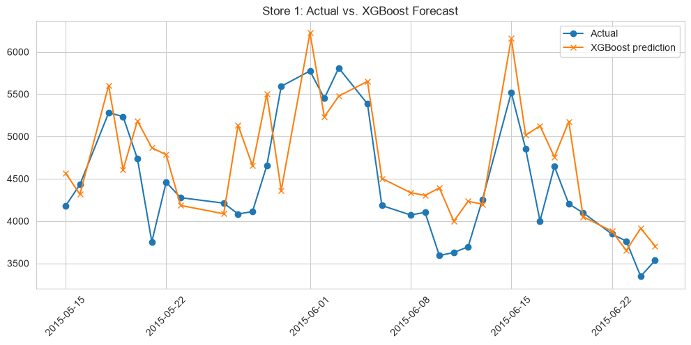

# Rossmann Store Sales Forecasting

Forecasting daily sales across 1,115 Rossmann drugstores using ~2.5 years of
panel data (Kaggle's Rossmann Store Sales competition). Includes full EDA,
time-aware lag/rolling feature engineering, a chronological train/validation/test
split, an XGBoost forecaster benchmarked against two naive baselines, SHAP-based
model interpretation, and a model-based counterfactual analysis of how much
sales lift promotions actually drive.

📄 **[Read the full report →](reports/final_report.md)**

## Results at a glance

Final model: **XGBoost** (`n_estimators=500`, `max_depth=8`, `learning_rate=0.05`, `subsample=0.8`, `colsample_bytree=0.8`)

| Model | RMSE | MAE | RMSPE |
|---|---|---|---|
| Naive: same day last week | 2758.8 | 2155.1 | 0.455 |
| Naive: 7-day rolling average | 2003.9 | 1482.8 | 0.337 |
| **XGBoost (final)** | **1097.1** | **848.3** | **≈0.2** |

*Metrics on the chronological validation set (38,555 store-days, 2015-05-15 to 2015-06-25). RMSPE is Kaggle's original competition metric ("average % off"); the XGBoost row is rounded to 1 decimal as reported in the notebook's own comparison table. See the [final report](reports/final_report.md#4-results) for feature importance and the promo-lift analysis.*



**A note on the promotion-lift finding:** a naive, uncontrolled comparison of
average sales on promo vs. non-promo days suggests a **38.8%** lift — but that
comparison is confounded (stores don't run promos at random). A model-based
counterfactual that holds store, season, day-of-week, and recent sales history
fixed puts the real effect closer to **20.5%**. See [Section 5 of the report](reports/final_report.md#5-how-much-does-a-promotion-actually-help)
for the full comparison.

## Project structure

```
rossmann-store-sales-forecasting/
├── README.md                  <- you are here
├── requirements.txt
├── LICENSE
├── data/
│   ├── README.md              <- dataset source, schema, how to download
│   ├── raw/                   <- (gitignored) train.csv / store.csv land here
│   └── processed/             <- (gitignored) optional cached feature tables
├── notebooks/
│   ├── 01_data_loading_and_eda.ipynb
│   ├── 02_feature_engineering_and_baseline_model.ipynb
│   ├── 03_forecasting_models_and_evaluation.ipynb
│   └── 04_interpretation_and_promo_impact.ipynb
├── src/
│   ├── data_loader.py         <- load + merge + clean the two raw CSVs
│   ├── features.py            <- calendar/lag/rolling features, chronological split
│   ├── train.py                <- XGBoost training + feature importance
│   ├── evaluate.py            <- RMSE/MAE/RMSPE, naive baselines, comparison table
│   └── interpret.py           <- SHAP helpers + counterfactual promo-lift analysis
├── models/                    <- (gitignored) trained model artifacts land here
└── reports/
    ├── final_report.md        <- full write-up: methodology, results, SHAP findings, promo-lift analysis, limitations
    ├── feature_importance.png
    ├── shap_feature_importance.png
    ├── shap_beeswarm.png
    ├── shap_promo_dependence.png
    ├── shap_waterfall_example.png
    ├── promo_lift_distribution.png
    └── figures/                <- EDA and model-performance charts referenced in the report
```

## Dataset

[Rossmann Store Sales](https://www.kaggle.com/c/rossmann-store-sales/data) —
Kaggle competition. 1,017,209 store-days × 9 columns in `train.csv`, joined
with 1,115 rows of store metadata in `store.csv`. Covers 2013-01-01 to
2015-07-31 across 1,115 stores. 17.0% of rows are closed-store days (dropped
for modeling, leaving 844,392 rows). Full schema and download instructions
in [`data/README.md`](data/README.md) — the raw files aren't committed here
per Kaggle's competition rules.

## How to run this project

```bash
git clone <this-repo-url>
cd rossmann-store-sales-forecasting
python -m venv .venv && source .venv/bin/activate   # optional but recommended
pip install -r requirements.txt

# Download the data (see data/README.md for the manual alternative)
kaggle competitions download -c rossmann-store-sales -p data/raw/
cd data/raw && unzip rossmann-store-sales.zip && cd ../..

# Option A — walk through the analysis notebook by notebook:
jupyter lab notebooks/

# Option B — use the reusable pipeline directly in Python:
python -c "
from src.data_loader import load_clean_data
from src.features import build_feature_pipeline, chronological_split, get_feature_columns
from src.train import train_xgboost
from src.evaluate import naive_baselines, compare_models

df = build_feature_pipeline(load_clean_data())
train_df, valid_df, test_df = chronological_split(df)
feature_cols = get_feature_columns(df)

model = train_xgboost(train_df[feature_cols], train_df['Sales'], valid_df[feature_cols], valid_df['Sales'])
preds = model.predict(valid_df[feature_cols])

print(naive_baselines(valid_df))
print(compare_models(valid_df['Sales'], {'XGBoost': preds}))
"
```

Notebooks are numbered and meant to be run in order — each one rebuilds the
same feature pipeline and chronological split (`2015-05-14` / `2015-06-25`
cutoffs) so results line up across notebooks 02–04.

## Methodology summary

1. **EDA** (`01`): load and merge, drop closed-store days, sales trend over time, day-of-week and monthly seasonality, promotion/holiday effects, store-level variation.
2. **Feature engineering + baseline** (`02`): calendar features; per-store lag (1/7/14-day) and rolling-average (7/30-day) sales features, each shifted to avoid leaking the target; a **chronological** 80/~4/~3.5% train/validation/test split (never random — this is time-series data); two naive baselines (same-day-last-week, 7-day rolling average) as the floor a real model has to beat.
3. **Forecasting model** (`03`): XGBoost trained on the engineered features, benchmarked against both naive baselines; feature importance.
4. **Interpretation & promotion impact** (`04`): SHAP `TreeExplainer` on the final model — global importance, beeswarm, dependence plots for `Promo` and `StateHoliday`; a **model-based counterfactual** that isolates the true promotion effect by holding every other factor fixed, contrasted against the naive (confounded) group-average comparison from notebook 01.

Full narrative, results tables, and discussion of limitations: **[reports/final_report.md](reports/final_report.md)**.

## Tech stack

Python · pandas · XGBoost · SHAP · matplotlib / seaborn · Jupyter

## License

[MIT](LICENSE)
