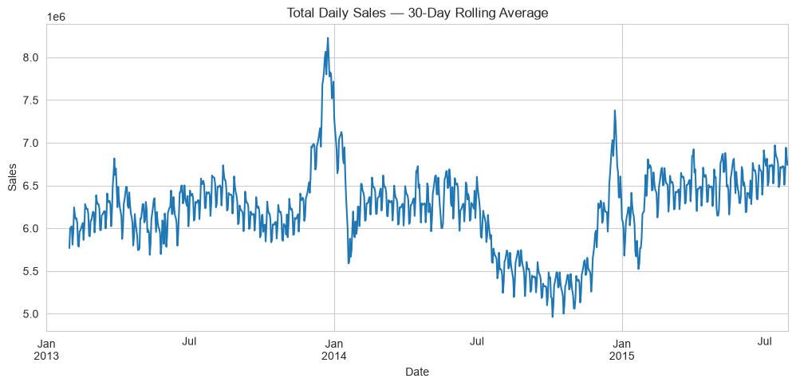
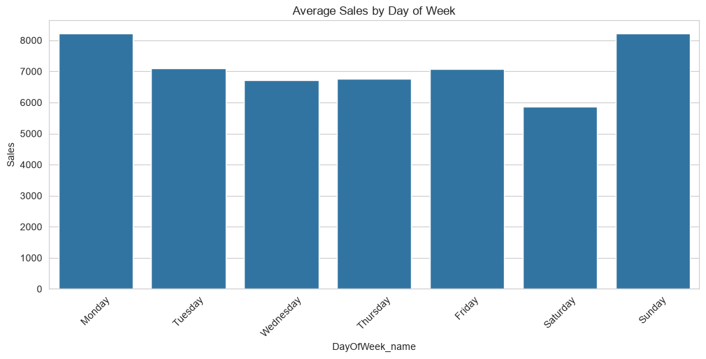
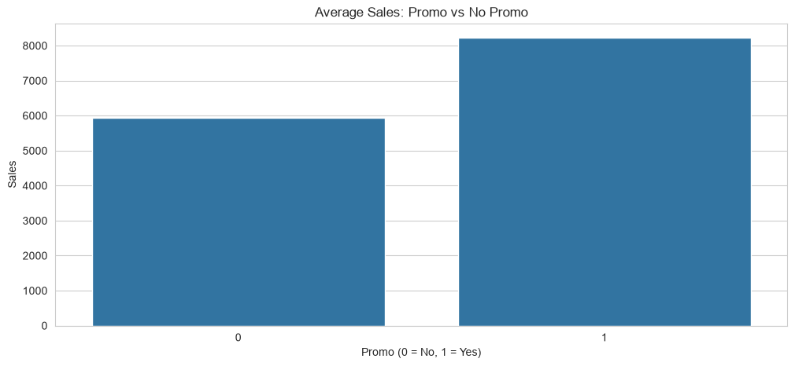
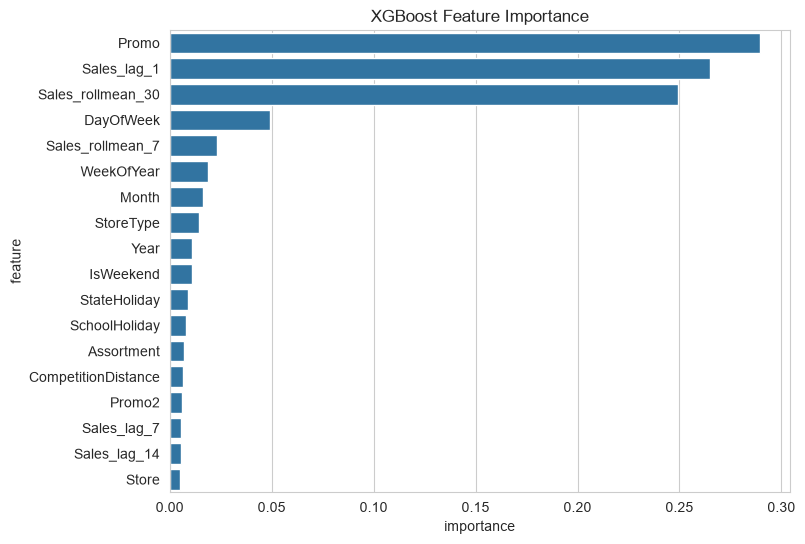
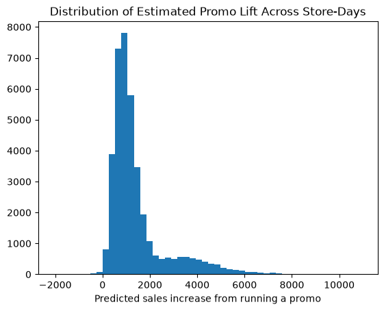
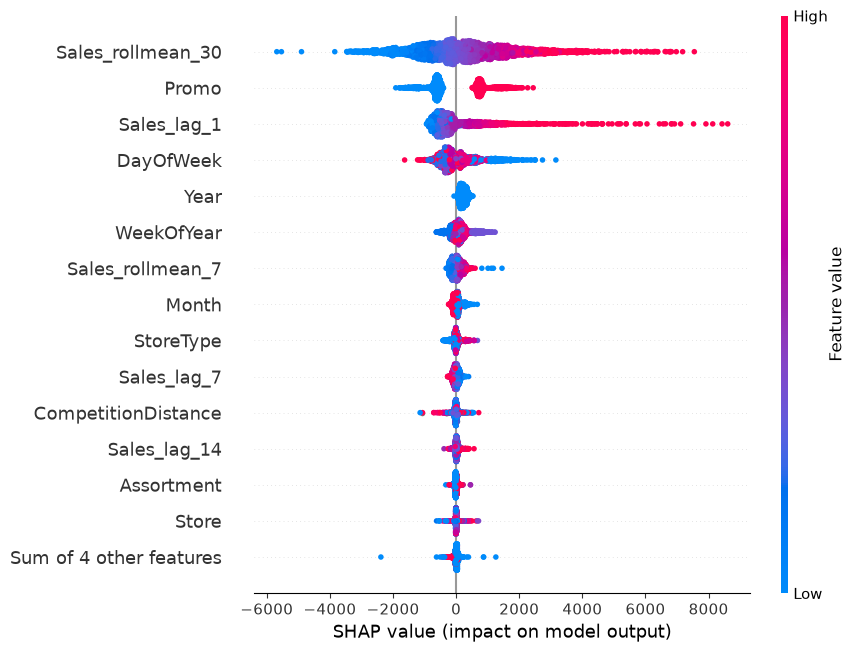
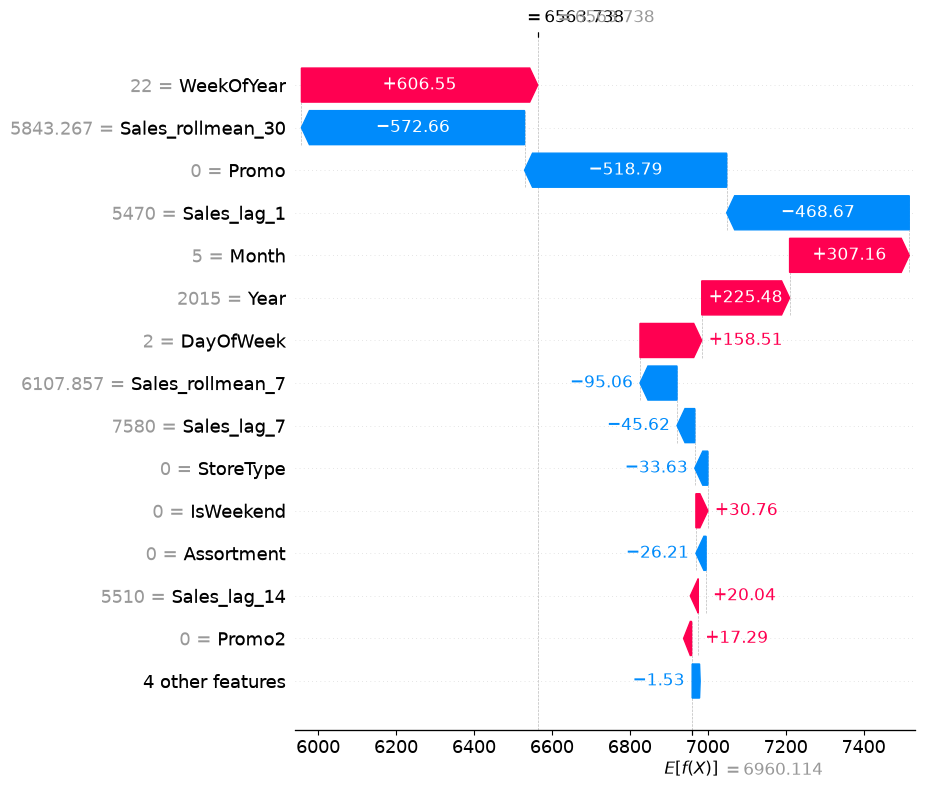

# Rossmann Store Sales Forecasting — Final Report

**Author:** Bhargavi Anupati
**Dataset:** Rossmann Store Sales (Kaggle competition; `train.csv` + `store.csv`)
**Notebooks:** [`01_data_loading_and_eda.ipynb`](../notebooks/01_data_loading_and_eda.ipynb) · [`02_feature_engineering_and_baseline_model.ipynb`](../notebooks/02_feature_engineering_and_baseline_model.ipynb) · [`03_forecasting_models_and_evaluation.ipynb`](../notebooks/03_forecasting_models_and_evaluation.ipynb) · [`04_interpretation_and_promo_impact.ipynb`](../notebooks/04_interpretation_and_promo_impact.ipynb)

---

## 1. Problem Statement

Retail demand forecasting — predicting how much a store will sell on a given
day — drives staffing, inventory, and promotion planning. This project asks
two questions using daily sales records from 1,115 Rossmann drugstores across
Germany:

1. **Can a time-aware model meaningfully beat naive forecasting baselines** using only calendar information, promotion/holiday flags, and each store's own recent sales history?
2. **How much of a sales lift does running a promotion actually cause**, once store-level and seasonal confounding are controlled for — as opposed to what a simple before/after or group-average comparison would suggest?

## 2. Data

- **Source:** [Rossmann Store Sales](https://www.kaggle.com/c/rossmann-store-sales/data), Kaggle.
- **Raw shape:** `train.csv` — 1,017,209 rows × 9 columns (one row per store-day); `store.csv` — 1,115 rows × 10 columns of static store metadata, joined on `Store`. Merged: 1,017,209 rows × 18 columns.
- **Coverage:** 1,115 stores, 2013-01-01 to 2015-07-31 (~2.5 years).
- **Closed-store days:** 17.0% of rows have `Open = 0` (`Sales` is always 0 then). These are dropped for modeling and for most EDA about sales levels, leaving **844,392 rows**.
- **Missing values:** `Promo2SinceWeek` / `PromoInterval` / `Promo2SinceYear` are missing for 508,031 rows (stores that never opted into the secondary "Promo2" campaign — a legitimate "not applicable," not a data error); `CompetitionOpenSinceMonth/Year` are missing for 323,348 rows; `CompetitionDistance` for 2,642 rows. Full column definitions are in [`data/README.md`](../data/README.md).

### Sales trend over time

Total daily sales across all 1,115 stores, smoothed with a 30-day rolling
average to see the underlying trend past the day-to-day and weekly noise:

### Day-of-week seasonality

Average sales are highest early in the week and drop toward Sunday (many
German stores have limited or no Sunday trading), a pattern the model's
`DayOfWeek` feature is built to capture:

### The naive promotion comparison

A simple group-average comparison already suggests promotions matter a lot —
but as Section 5 shows, this comparison is confounded and overstates the
true effect:

Average sales with no promo: **5,929**; with a promo running: **8,228** — a
naive, uncontrolled difference of **+38.8%**.

## 3. Methodology

### 3.1 Feature engineering

- **Calendar features:** day of week, month, year, ISO week of year, weekend flag — cheap to compute and often surprisingly predictive.
- **Lag features (per store):** sales 1, 7, and 14 days ago (`Sales_lag_1/7/14`), computed with `groupby('Store')` so one store's history never leaks into another's.
- **Rolling features (per store):** trailing 7-day and 30-day sales averages (`Sales_rollmean_7/30`), each shifted by one day first so the window never includes the current day's own sales (which would leak the target).
- Rows with insufficient per-store history for these features (the first ~14–30 days of each store's series) are **dropped rather than filled** — filling would fabricate history that doesn't exist. This removes 33,450 rows (4.0%), leaving **810,942 rows** for modeling.
- A handful of categorical columns (`StoreType`, `Assortment`, `StateHoliday`) are integer-coded so XGBoost can use them directly.

### 3.2 Chronological train/validation/test split

Unlike a typical i.i.d. modeling problem, rows here **cannot be randomly
shuffled** into train/test — a random split would let the model "see the
future" (e.g., train on a Tuesday in March while testing on the preceding
Monday), inflating performance in a way that won't hold up on genuinely new
data. Instead, the data is split by date, mirroring how the model would
actually be used — forecasting forward from the past:

| Split | Rows | Date range |
|---|---|---|
| Train | 737,707 | 2013-01-31 – 2015-05-14 |
| Validation | 38,555 | 2015-05-15 – 2015-06-25 |
| Test (held out) | 34,680 | 2015-06-26 – 2015-07-31 |

### 3.3 Naive baselines

Before any real model, two trivial forecasts establish what a naive approach
already achieves:

- **Same day last week** — predict this day's sales using `Sales_lag_7`.
- **7-day rolling average** — predict using the trailing 7-day mean (`Sales_rollmean_7`).

If a sophisticated model can't beat these, it isn't adding value.

### 3.4 Forecasting model

**XGBoost** (`XGBRegressor`): `n_estimators=500`, `max_depth=8`,
`learning_rate=0.05`, `subsample=0.8`, `colsample_bytree=0.8`,
`random_state=42`. Trained on the 18-feature set described above.

## 4. Results

All metrics below are on the **validation set** (38,555 rows). RMSPE (Root
Mean Squared Percentage Error) is the original Kaggle competition metric —
the most intuitive of the three to explain as "average % off."

| Model | RMSE | MAE | RMSPE |
|---|---|---|---|
| Naive: same day last week | 2758.8 | 2155.1 | 0.455 |
| Naive: 7-day rolling average | 2003.9 | 1482.8 | 0.337 |
| **XGBoost** | **1097.1** | **848.3** | **≈0.2** |

XGBoost roughly **halves the error** of the better naive baseline (RMSE 1097
vs. 2004), confirming the engineered lag/rolling/calendar features carry
real predictive signal beyond "assume next week looks like last week."

> **On the held-out test set:** a chronological test split (34,680 rows,
> 2015-06-26 to 2015-07-31) was carved out and is available in
> `src/features.chronological_split()`, but this project's notebooks report
> all metrics on the validation split only — the test set was reserved but
> not scored in the current notebooks. Scoring the final model on the test
> split is a natural next step before treating these numbers as a final,
> unbiased estimate of real-world performance (see Section 7).

### Feature importance

| Feature | Importance |
|---|---|
| `Promo` | 0.290 |
| `Sales_lag_1` | 0.265 |
| `Sales_rollmean_30` | 0.249 |
| `DayOfWeek` | 0.049 |
| `Sales_rollmean_7` | 0.023 |
| `WeekOfYear` | 0.019 |
| `Month` | 0.016 |
| `StoreType` | 0.014 |
| *(remaining 9 features)* | 0.056 combined |

The single most striking result here: **`Promo` is the single most important
feature to the model — ahead of yesterday's own sales.** Together, `Promo`,
`Sales_lag_1`, and `Sales_rollmean_30` account for roughly 80% of total
feature importance; the rest of the feature set (day-of-week, seasonality,
store type, competition distance, etc.) contributes comparatively little on
top of "was there a promo, and what has this store been selling lately."

## 5. How Much Does a Promotion Actually Help?

This was the project's core causal-style question, and it's answered two
ways on purpose — to show why the naive answer is misleading.

**Naive comparison (Section 2):** average sales on promo days (8,228) vs.
non-promo days (5,929) — a raw difference of **+38.8%**. This number is
confounded: stores don't run promotions at random, so this comparison mixes
in whichever stores, seasons, and days of the week happen to run more
promotions.

**Model-based counterfactual (rigorous):** using the trained XGBoost model,
every validation row is scored twice — once with `Promo` forced to 0, once
with `Promo` forced to 1 — with every other feature (store, day of week,
season, recent sales history) held fixed. This isolates the promotion effect
from everything else the model has learned to associate with promotions.

| | Naive group average | Model-based counterfactual |
|---|---|---|
| Estimated lift | **+38.8%** | **+20.5%** |
| Basis | Raw average, confounded by store/season | Same rows, `Promo` toggled, other factors held fixed |

Average predicted sales without a promo: **7,024**; with a promo: **8,466** —
an absolute lift of **+1,442 per store-day**, or **+20.5%**, once
confounding is controlled for. The gap between 38.8% and 20.5% is itself the
finding: **nearly half of the naive "promo effect" is actually other factors
correlated with when stores choose to run promotions**, not the promotion
itself.

**Caveat:** this is a model-based counterfactual, not a randomized
experiment. It assumes XGBoost has correctly learned how `Promo` interacts
with the other features — a reasonable and commonly used approach for
observational data, but an assumption worth stating plainly rather than
presenting as definitive causal proof.

## 6. Model Interpretation (SHAP)

SHAP (`TreeExplainer`) was applied to a 3,000-row sample of the validation
set to explain the XGBoost model's predictions directly (independent of, and
consistent with, the native feature-importance ranking in Section 4).

SHAP agrees with the native XGBoost importance in Section 4 on which three
features dominate — `Promo`, `Sales_lag_1`, and `Sales_rollmean_30` — though
the two metrics rank them slightly differently (`Sales_rollmean_30` edges out
the other two by mean |SHAP value|, vs. `Promo` ranking first by XGBoost's
internal gain). The beeswarm also confirms the *direction* of each effect,
not just its magnitude: higher recent sales push predicted sales up, as
expected, and `Promo = 1` (red) consistently pushes predicted sales higher
than `Promo = 0` (blue) — visually corroborating the counterfactual result in
Section 5.

An individual forecast explanation — useful for showing the model reasoning
about one specific store-day, not just in aggregate:

## 7. Limitations

- **Validation-only reporting.** As noted in Section 4, a chronological test split was created but the project's notebooks report metrics on the validation set only; the held-out test period (2015-06-26 to 2015-07-31) was never scored. Doing so is the most important next step before quoting these numbers as a final, unbiased performance estimate.
- **The counterfactual promo-lift estimate is model-based, not experimental.** It's only as trustworthy as the model's ability to have learned Promo's true interaction effects — see the caveat in Section 5.
- **`Customers` was deliberately excluded as a feature**, since it isn't known in advance at forecast time (only knowable after the fact) — including it would leak information a real forecast wouldn't have.
- **Prophet was scaffolded but not run in this version.** Notebook 04 includes a commented-out section for a single-store Prophet forecast as a classic time-series comparison point; it wasn't executed for this report, so no Prophet results are claimed here.
- **Store-level heterogeneity.** EDA showed meaningfully different sales patterns by `StoreType` and between individual stores; a single global model may underfit unusually large or unusual stores relative to a store-specific model.
- **Data is specific to one retailer, one country, and one time window (2013–2015).** Generalization to other retailers or more recent periods is untested.

## 8. Conclusion

An XGBoost model using calendar features and per-store lag/rolling sales
history roughly halves the forecasting error of the best naive baseline
(RMSE 1097 vs. 2004 on the validation set), confirming that recent sales
history and promotion status carry substantial forecastable signal.
Feature importance and SHAP both point to the same conclusion: whether a
promotion is running is, surprisingly, the single strongest predictor in the
model — more important than the store's own sales from the previous day.
Digging into that relationship with a model-based counterfactual shows the
true promotional lift is real but more modest than a naive comparison
suggests: **≈20.5%**, against a naive estimate of 38.8% that was inflated by
confounding between promotion timing and other factors. That gap is a useful
reminder for any retail analytics context: a raw before/after or group
comparison of a marketing intervention can overstate its impact, and
isolating the effect while controlling for other drivers matters for making
a sound investment decision about running more promotions.
